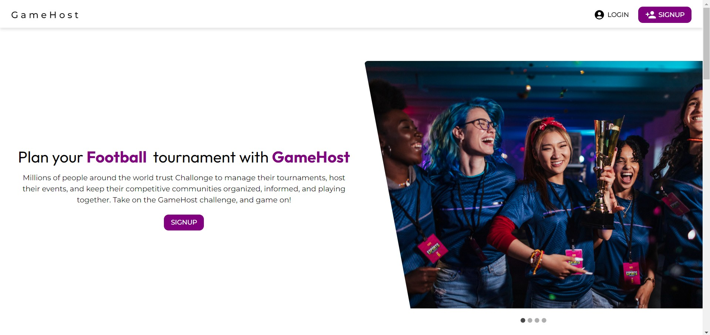
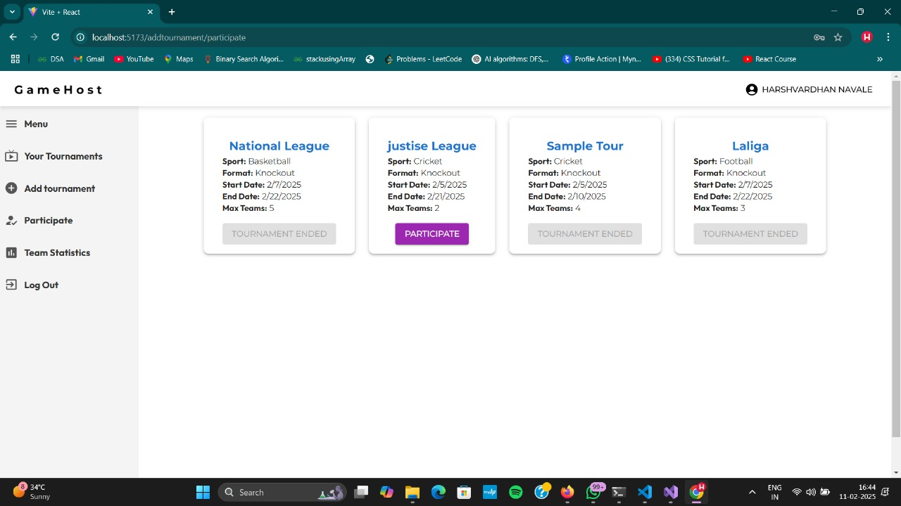

# GameHost Hub

GameHost Hub is an online platform for hosting and managing sports and esports tournaments. Developed as part of the PG-DAC course at CDAC, Pune, the platform enables users to register, host tournaments, join events, and track live scores—all in one place.

## Table of Contents
- [Overview](#overview)
- [Features](#features)
- [Technologies Used](#technologies-used)
- [Usage](#usage)
- [Contributing](#contributing)
- [License](#license)
- [Acknowledgements](#acknowledgements)

## Overview
GameHost Hub provides a comprehensive solution for tournament management by supporting knockout tournament format. The platform offers automated match scheduling, real-time score tracking, and secure user management to ensure a seamless experience for organizers, teams, and players.

## Features
- **User Registration & Profiles:**  
  Users can sign up, manage their profiles, and view tournament history.
- **Tournament Hosting:**  
  Organizers can create tournaments by setting game types, formats, dates, and privacy options.
- **Tournament Joining:**  
  Players and teams can join tournaments via search or invitation links.
- **Automated Scheduling:**  
  The system generates match schedules automatically.
- **Real-Time Score Tracking:**  
  Live updates on match scores, brackets, and leaderboards.

## Technologies Used
### Front-End:
- HTML, CSS, JavaScript  
- React for building a dynamic and responsive user interface  
- Axios for API communication  

### Back-End:
- MS .NET framework for business logic and RESTful API development  

### Database:
- MSSQL for reliable and structured data management  

## Usage
1. **Start the Back-End:**
   - Open the project in Visual Studio and run using IIS Express or Kestrel.
2. **Run the Front-End:**
   ```bash
   cd frontend
   npm start
   ```
3. **Access the Application**
- Navigate to [http://localhost:3000](http://localhost:3000) (or your configured port) in your browser.



4. **Explore:**
- Register a new account, host a tournament, or join an existing one via invitation links or the tournament search feature.



## Contributing
Contributions are welcome! Please follow these steps:

1. **Fork** the repository.
2. **Create a new branch** for your feature or bug fix.
3. **Commit** your changes with clear commit messages.
4. **Open a pull request** for review.

For major changes, please **open an issue** first to discuss your ideas.

## License
This project is licensed under the **MIT License**.

## Acknowledgements

### References:
- [Microsoft Documentation](https://docs.microsoft.com)  
- [React Official Website](https://react.dev)  
- [Axios Documentation](https://axios-http.com)  
- [MSSQL Documentation](https://learn.microsoft.com/en-us/sql)  
- [PostgreSQL Documentation](https://www.postgresql.org/docs/)

